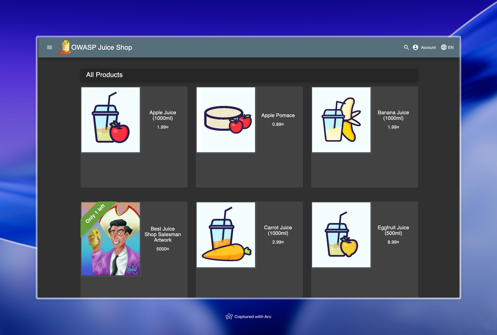
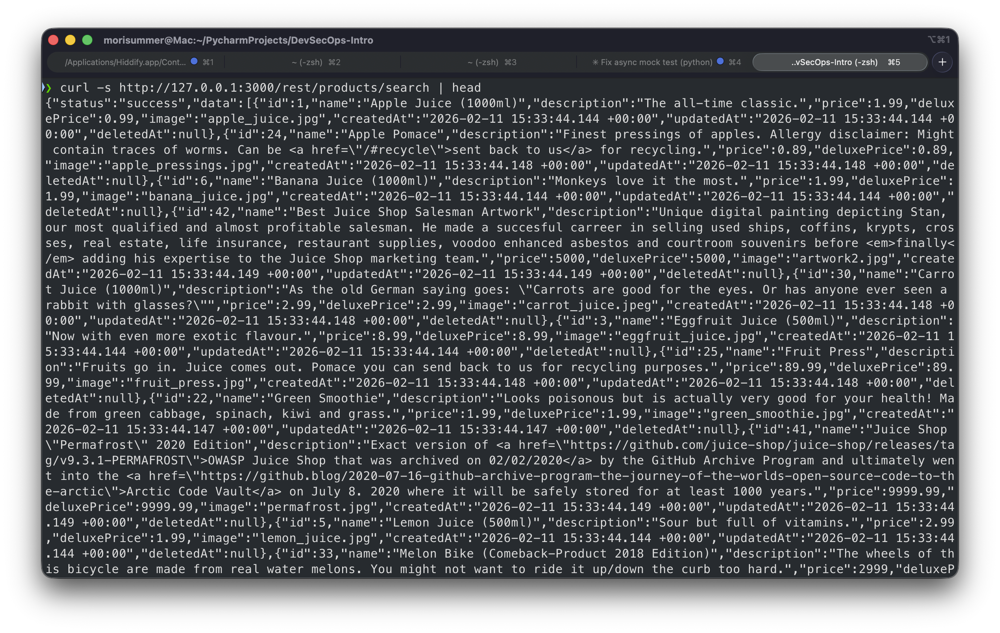
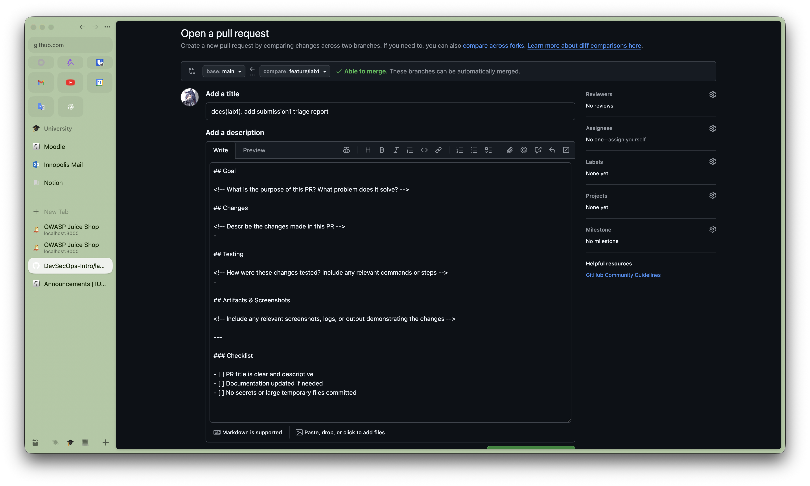

# Lab 1 Submission — OWASP Juice Shop & PR Workflow

---

## Task 1 — OWASP Juice Shop Deployment

# Triage Report — OWASP Juice Shop

## Scope & Asset
- Asset: OWASP Juice Shop (local lab instance)
- Image: bkimminich/juice-shop:v19.0.0
- Release link/date: https://github.com/juice-shop/juice-shop/releases/tag/v19.0.0 — 2025-03-05
- Image digest (optional): `bkimminich/juice-shop@sha256:2765a26de7647609099a338d5b7f61085d95903c8703bb70f03fcc4b12f0818d`

## Environment
- Host OS: `macOS 26.2`
- Docker: `Docker version 26.1.3, build b72abbb6f0`

## Deployment Details
- Run command used: `docker run -d --name juice-shop -p 127.0.0.1:3000:3000 bkimminich/juice-shop:v19.0.0`
- Access URL: http://127.0.0.1:3000
- Network exposure: 127.0.0.1 only [x] Yes  [ ] No
  - Note: Container is bound to localhost only, not exposed externally

## Health Check
- Page load:


- API check: First lines from `curl -s http://127.0.0.1:3000/rest/products/search | head`
```json
{"status":"success","data":[{"id":1,"name":"Apple Juice (1000ml)","description":"The all-time classic.","price":1.99,"deluxePrice":0.99,"image":"apple_juice.jpg","createdAt":"2026-02-11 15:33:44.144 +00:00","updatedAt":"2026-02-11 15:33:44.144 +00:00","deletedAt":null},{"id":24,"name":"Apple Pomace","description":"Finest pressings of apples. Allergy disclaimer: Might contain traces of worms. Can be <a href=\"/#recycle\">sent back to us</a> for recycling.","price":0.89,"deluxePrice":0.89,"image":"apple_pressings.jpg","createdAt":"2026-02-11 15:33:44.148 +00:00","updatedAt":"2026-02-11 15:33:44.148 +00:00","deletedAt":null},{"id":6,"name":"Banana Juice (1000ml)","description":"Monkeys love it the most.","price":1.99,"deluxePrice":1.99,"image":"banana_juice.jpg","createdAt":"2026-02-11 15:33:44.144 +00:00","updatedAt":"2026-02-11 15:33:44.144 +00:00","deletedAt":null},{"id":42,"name":"Best Juice Shop Salesman Artwork","description":"Unique digital painting depicting Stan, our most qualified and almost profitable salesman. He made a succesful carreer in selling used ships, coffins, krypts, crosses, real estate, life insurance, restaurant supplies, voodoo enhanced asbestos and courtroom souvenirs before <em>finally</em> adding his expertise to the Juice Shop marketing team.","price":5000,"deluxePrice":5000,"image":"artwork2.jpg","createdAt":"2026-02-11 15:33:44.149 +00:00","updatedAt":"2026-02-11 15:33:44.149 +00:00","deletedAt":null},{"id":30,"name":"Carrot Juice (1000ml)","description":"As the old German saying goes: \"Carrots are good for the eyes. Or has anyone ever seen a rabbit with glasses?\"","price":2.99,"deluxePrice":2.99,"image":"carrot_juice.jpeg","createdAt":"2026-02-11 15:33:44.148 +00:00","updatedAt":"2026-02-11 15:33:44.148 +00:00","deletedAt":null},{"id":3,"name":"Eggfruit Juice (500ml)","description":"Now with even more exotic flavour.","price":8.99,"deluxePrice":8.99,"image":"eggfruit_juice.jpg","createdAt":"2026-02-11 15:33:44.144 +00:00","updatedAt":"2026-02-11 15:33:44.144 +00:00","deletedAt":null},{"id":25,"name":"Fruit Press","description":"Fruits go in. Juice comes out. Pomace you can send back to us for recycling purposes.","price":89.99,"deluxePrice":89.99,"image":"fruit_press.jpg","createdAt":"2026-02-11 15:33:44.148 +00:00","updatedAt":"2026-02-11 15:33:44.148 +00:00","deletedAt":null},{"id":22,"name":"Green Smoothie","description":"Looks poisonous but is actually very good for your health! Made from green cabbage, spinach, kiwi and grass.","price":1.99,"deluxePrice":1.99,"image":"green_smoothie.jpg","createdAt":"2026-02-11 15:33:44.147 +00:00","updatedAt":"2026-02-11 15:33:44.147 +00:00","deletedAt":null},{"id":41,"name":"Juice Shop \"Permafrost\" 2020 Edition","description":"Exact version of <a href=\"https://github.com/juice-shop/juice-shop/releases/tag/v9.3.1-PERMAFROST\">OWASP Juice Shop that was archived on 02/02/2020</a> by the GitHub Archive Program and ultimately went into the <a href=\"https://github.blog/2020-07-16-github-archive-program-the-journey-of-the-worlds-open-source-code-to-the-arctic\">Arctic Code Vault</a> on July 8. 2020 where it will be safely stored for at least 1000 years.","price":9999.99,"deluxePrice":9999.99,"image":"permafrost.jpg","createdAt":"2026-02-11 15:33:44.149 +00:00","updatedAt":"2026-02-11 15:33:44.149 +00:00","deletedAt":null},{"id":5,"name":"Lemon Juice (500ml)","description":"Sour but full of vitamins.","price":2.99,"deluxePrice":1.99,"image":"lemon_juice.jpg","createdAt":"2026-02-11 15:33:44.144 +00:00","updatedAt":"2026-02-11 15:33:44.144 +00:00","deletedAt":null},{"id":33,"name":"Melon Bike (Comeback-Product 2018 Edition)","description":"The wheels of this bicycle are made from real water melons. You might not want to ride it up/down the curb too hard.","price":2999,"deluxePrice":2999,"image":"melon_bike.jpeg","createdAt":"2026-02-11 15:33:44.148 +00:00","updatedAt":"2026-02-11 15:33:44.148 +00:00","deletedAt":null},{"id":38,"name":"OWASP Juice Shop \"King of the Hill\" Facemask","description":"Facemask with compartment for filter from 50% cotton and 50% polyester.","price":13.49,"deluxePrice":13.49,"image":"fan_facemask.jpg","createdAt":"2026-02-11 15:33:44.148 +00:00","updatedAt":"2026-02-11 15:33:44.148 +00:00","deletedAt":null},{"id":8,"name":"OWASP Juice Shop CTF Girlie-Shirt","description":"For serious Capture-the-Flag heroines only!","price":22.49,"deluxePrice":22.49,"image":"fan_girlie.jpg","createdAt":"2026-02-11 15:33:44.144 +00:00","updatedAt":"2026-02-11 15:33:44.144 +00:00","deletedAt":null},{"id":43,"name":"OWASP Juice Shop Card (non-foil)","description":"Mythic rare <em>(obviously...)</em> card \"OWASP Juice Shop\" with three distinctly useful abilities. Alpha printing, mint condition. A true collectors piece to own!","price":1000,"deluxePrice":1000,"image":"card_alpha.jpg","createdAt":"2026-02-11 15:33:44.149 +00:00","updatedAt":"2026-02-11 15:33:44.149 +00:00","deletedAt":null},{"id":34,"name":"OWASP Juice Shop Coaster (10pcs)","description":"Our 95mm circle coasters are printed in full color and made from thick, premium coaster board.","price":19.99,"deluxePrice":19.99,"image":"coaster.jpg","createdAt":"2026-02-11 15:33:44.148 +00:00","updatedAt":"2026-02-11 15:33:44.148 +00:00","deletedAt":null},{"id":37,"name":"OWASP Juice Shop Holographic Sticker","description":"Die-cut holographic sticker. Stand out from those 08/15-sticker-covered laptops with this shiny beacon of 80's coolness!","price":2,"deluxePrice":2,"image":"holo_sticker.png","createdAt":"2026-02-11 15:33:44.148 +00:00","updatedAt":"2026-02-11 15:33:44.148 +00:00","deletedAt":null},{"id":19,"name":"OWASP Juice Shop Hoodie","description":"Mr. Robot-style apparel. But in black. And with logo.","price":49.99,"deluxePrice":49.99,"image":"fan_hoodie.jpg","createdAt":"2026-02-11 15:33:44.147 +00:00","updatedAt":"2026-02-11 15:33:44.147 +00:00","deletedAt":null},{"id":13,"name":"OWASP Juice Shop Iron-Ons (16pcs)","description":"Upgrade your clothes with washer safe <a href=\"https://www.stickeryou.com/products/owasp-juice-shop/794\" target=\"_blank\">iron-ons</a> of the OWASP Juice Shop or CTF Extension logo!","price":14.99,"deluxePrice":14.99,"image":"iron-on.jpg","createdAt":"2026-02-11 15:33:44.146 +00:00","updatedAt":"2026-02-11 15:33:44.146 +00:00","deletedAt":null},{"id":45,"name":"OWASP Juice Shop LEGO™ Tower","description":"Want to host a Juice Shop CTF in style? Build <a href=\"https://github.com/OWASP/owasp-swag/blob/master/projects/juice-shop/lego/OWASP%20JuiceShop%20Pi-server%201.2.pdf\" target=\"_blank\">your own LEGO™ tower</a> which holds four Raspberry Pi 4 models with PoE HAT modules <a href=\"https://github.com/juice-shop/multi-juicer/blob/main/guides/raspberry-pi/raspberry-pi.md\" target=\"_blank\">running a MultiJuicer Kubernetes cluster</a>! Wire to a switch and connect to your network to have an out-of-the-box ready CTF up in no time!","price":799,"deluxePrice":799,"image":"lego_case.jpg","createdAt":"2026-02-11 15:33:44.149 +00:00","updatedAt":"2026-02-11 15:33:44.149 +00:00","deletedAt":null},{"id":26,"name":"OWASP Juice Shop Logo (3D-printed)","description":"This rare item was designed and handcrafted in Sweden. This is why it is so incredibly expensive despite its complete lack of purpose.","price":99.99,"deluxePrice":99.99,"image":"3d_keychain.jpg","createdAt":"2026-02-11 15:33:44.148 +00:00","updatedAt":"2026-02-11 15:33:44.148 +00:00","deletedAt":null},{"id":14,"name":"OWASP Juice Shop Magnets (16pcs)","description":"Your fridge will be even cooler with these OWASP Juice Shop or CTF Extension logo <a href=\"https://www.stickeryou.com/products/owasp-juice-shop/794\" target=\"_blank\">magnets</a>!","price":15.99,"deluxePrice":15.99,"image":"magnets.jpg","createdAt":"2026-02-11 15:33:44.147 +00:00","updatedAt":"2026-02-11 15:33:44.147 +00:00","deletedAt":null},{"id":18,"name":"OWASP Juice Shop Mug","description":"Black mug with regular logo on one side and CTF logo on the other! Your colleagues will envy you!","price":21.99,"deluxePrice":21.99,"image":"fan_mug.jpg","createdAt":"2026-02-11 15:33:44.147 +00:00","updatedAt":"2026-02-11 15:33:44.147 +00:00","deletedAt":null},{"id":15,"name":"OWASP Juice Shop Sticker Page","description":"Massive decoration opportunities with these OWASP Juice Shop or CTF Extension <a href=\"https://www.stickeryou.com/products/owasp-juice-shop/794\" target=\"_blank\">sticker pages</a>! Each page has 16 stickers on it.","price":9.99,"deluxePrice":9.99,"image":"sticker_page.jpg","createdAt":"2026-02-11 15:33:44.147 +00:00","updatedAt":"2026-02-11 15:33:44.147 +00:00","deletedAt":null},{"id":16,"name":"OWASP Juice Shop Sticker Single","description":"Super high-quality vinyl <a href=\"https://www.stickeryou.com/products/owasp-juice-shop/794\" target=\"_blank\">sticker single</a> with the OWASP Juice Shop or CTF Extension logo! The ultimate laptop decal!","price":4.99,"deluxePrice":4.99,"image":"sticker_single.jpg","createdAt":"2026-02-11 15:33:44.147 +00:00","updatedAt":"2026-02-11 15:33:44.147 +00:00","deletedAt":null},{"id":7,"name":"OWASP Juice Shop T-Shirt","description":"Real fans wear it 24/7!","price":22.49,"deluxePrice":22.49,"image":"fan_shirt.jpg","createdAt":"2026-02-11 15:33:44.144 +00:00","updatedAt":"2026-02-11 15:33:44.144 +00:00","deletedAt":null},{"id":17,"name":"OWASP Juice Shop Temporary Tattoos (16pcs)","description":"Get one of these <a href=\"https://www.stickeryou.com/products/owasp-juice-shop/794\" target=\"_blank\">temporary tattoos</a> to proudly wear the OWASP Juice Shop or CTF Extension logo on your skin! If you tweet a photo of yourself with the tattoo, you get a couple of our stickers for free! Please mention <a href=\"https://twitter.com/owasp_juiceshop\" target=\"_blank\"><code>@owasp_juiceshop</code></a> in your tweet!","price":14.99,"deluxePrice":14.99,"image":"tattoo.jpg","createdAt":"2026-02-11 15:33:44.147 +00:00","updatedAt":"2026-02-11 15:33:44.147 +00:00","deletedAt":null},{"id":20,"name":"OWASP Juice Shop-CTF Velcro Patch","description":"4x3.5\" embroidered patch with velcro backside. The ultimate decal for every tactical bag or backpack!","price":2.92,"deluxePrice":2.92,"image":"velcro-patch.jpg","createdAt":"2026-02-11 15:33:44.147 +00:00","updatedAt":"2026-02-11 15:33:44.147 +00:00","deletedAt":null},{"id":9,"name":"OWASP SSL Advanced Forensic Tool (O-Saft)","description":"O-Saft is an easy to use tool to show information about SSL certificate and tests the SSL connection according given list of ciphers and various SSL configurations. <a href=\"https://www.owasp.org/index.php/O-Saft\" target=\"_blank\">More...</a>","price":0.01,"deluxePrice":0.01,"image":"orange_juice.jpg","createdAt":"2026-02-11 15:33:44.146 +00:00","updatedAt":"2026-02-11 15:33:44.146 +00:00","deletedAt":null},{"id":36,"name":"OWASP Snakes and Ladders - Mobile Apps","description":"This amazing mobile app security awareness board game is <a href=\"https://steamcommunity.com/sharedfiles/filedetails/?id=1970691216\">available for Tabletop Simulator on Steam Workshop</a> now!","price":0.01,"deluxePrice":0.01,"image":"snakes_ladders_m.jpg","createdAt":"2026-02-11 15:33:44.148 +00:00","updatedAt":"2026-02-11 15:33:44.148 +00:00","deletedAt":null},{"id":35,"name":"OWASP Snakes and Ladders - Web Applications","description":"This amazing web application security awareness board game is <a href=\"https://steamcommunity.com/sharedfiles/filedetails/?id=1969196030\">available for Tabletop Simulator on Steam Workshop</a> now!","price":0.01,"deluxePrice":0.01,"image":"snakes_ladders.jpg","createdAt":"2026-02-11 15:33:44.148 +00:00","updatedAt":"2026-02-11 15:33:44.148 +00:00","deletedAt":null},{"id":2,"name":"Orange Juice (1000ml)","description":"Made from oranges hand-picked by Uncle Dittmeyer.","price":2.99,"deluxePrice":2.49,"image":"orange_juice.jpg","createdAt":"2026-02-11 15:33:44.144 +00:00","updatedAt":"2026-02-11 15:33:44.144 +00:00","deletedAt":null},{"id":32,"name":"Pwning OWASP Juice Shop","description":"<em>The official Companion Guide</em> by Björn Kimminich available <a href=\"https://leanpub.com/juice-shop\">for free on LeanPub</a> and also <a href=\"https://pwning.owasp-juice.shop\">readable online</a>!","price":5.99,"deluxePrice":5.99,"image":"cover_small.jpg","createdAt":"2026-02-11 15:33:44.148 +00:00","updatedAt":"2026-02-11 15:33:44.148 +00:00","deletedAt":null},{"id":23,"name":"Quince Juice (1000ml)","description":"Juice of the <em>Cydonia oblonga</em> fruit. Not exactly sweet but rich in Vitamin C.","price":4.99,"deluxePrice":4.99,"image":"quince.jpg","createdAt":"2026-02-11 15:33:44.147 +00:00","updatedAt":"2026-02-11 15:33:44.147 +00:00","deletedAt":null},{"id":4,"name":"Raspberry Juice (1000ml)","description":"Made from blended Raspberry Pi, water and sugar.","price":4.99,"deluxePrice":4.99,"image":"raspberry_juice.jpg","createdAt":"2026-02-11 15:33:44.144 +00:00","updatedAt":"2026-02-11 15:33:44.144 +00:00","deletedAt":null},{"id":29,"name":"Strawberry Juice (500ml)","description":"Sweet & tasty!","price":3.99,"deluxePrice":3.99,"image":"strawberry_juice.jpeg","createdAt":"2026-02-11 15:33:44.148 +00:00","updatedAt":"2026-02-11 15:33:44.148 +00:00","deletedAt":null},{"id":21,"name":"Woodruff Syrup \"Forest Master X-Treme\"","description":"Harvested and manufactured in the Black Forest, Germany. Can cause hyperactive behavior in children. Can cause permanent green tongue when consumed undiluted.","price":6.99,"deluxePrice":6.99,"image":"woodruff_syrup.jpg","createdAt":"2026-02-11 15:33:44.147 +00:00","updatedAt":"2026-02-11 15:33:44.147 +00:00","deletedAt":null}]}%
```

## Surface Snapshot (Triage)
- Login/Registration visible: [x] Yes  [ ] No — notes: Login form accessible via navbar; no CAPTCHA observed
- Product listing/search present: [x] Yes  [ ] No — notes: Products displayed on main page with search functionality in navbar
- Admin or account area discoverable: [x] Yes  [ ] No — notes: `/administration` path exists (returns 403 without auth); user account section visible after login
- Client-side errors in console: [ ] Yes  [x] No
- Security headers (quick look):
  ```
    Access-Control-Allow-Origin: *
    X-Content-Type-Options: nosniff
    X-Frame-Options: SAMEORIGIN
    Feature-Policy: payment 'self'
    X-Recruiting: /#/jobs
    Accept-Ranges: bytes
    Cache-Control: public, max-age=0
    Last-Modified: Wed, 11 Feb 2026 15:33:45 GMT
    ETag: W/"124fa-19c4d5643e7"
    Content-Type: text/html; charset=UTF-8
    Content-Length: 75002
    Vary: Accept-Encoding
    Date: Wed, 11 Feb 2026 15:40:18 GMT
    Connection: keep-alive
    Keep-Alive: timeout=5
  ```
  - CSP present: No
  - HSTS present: No

## Risks Observed (Top 3)

1. **SQL Injection vulnerability** — The search functionality and login forms may be vulnerable to SQL injection attacks, as this is a deliberately vulnerable application designed to teach web security.

2. **Broken Access Control** — Admin functionality appears to be accessible through predictable paths (`/administration`), and authorization checks may be bypassable through parameter manipulation or JWT token tampering.

3. **Cross-Site Scripting (XSS)** — User input fields (search, feedback, product reviews) likely lack proper sanitization, making reflected and stored XSS attacks possible.

---

## Task 2 — PR Template Setup

### PR Template Creation Process

1. Created `.github/pull_request_template.md` in the repository
2. Template includes the required sections:
   - **Goal** — Purpose of the PR
   - **Changes** — Description of modifications
   - **Testing** — How changes were verified
   - **Artifacts & Screenshots** — Visual evidence
3. Checklist includes three items:
   - Clear title requirement
   - Documentation update check
   - No secrets/large files check

### Template Verification

The PR template was committed to the main branch first (as required by GitHub), then a feature branch was created for the lab submission. When opening the PR, the template sections automatically populated the description field.

### How Templates Improve Collaboration

PR templates standardize the review process by ensuring every submission includes consistent information. This:
- Reduces back-and-forth communication by preemptively answering common reviewer questions
- Creates a checklist culture that catches common issues before review
- Makes the PR history more searchable and understandable for future maintainers
- Establishes team conventions without requiring constant manual enforcement

---

## Task 6 — GitHub Community Engagement

### Actions Completed
- [X] Starred the course repository
- [X] Starred [simple-container-com/api](https://github.com/simple-container-com/api)
- [X] Followed Professor [@Cre-eD](https://github.com/Cre-eD)
- [X] Followed TA [@marat-biriushev](https://github.com/marat-biriushev)
- [X] Followed TA [@pierrepicaud](https://github.com/pierrepicaud)
- [X] Followed 3+ classmates

### GitHub Community Reflection

**Why starring repositories matters:** Stars serve as bookmarks for useful projects and signal community appreciation to maintainers. High star counts help projects gain visibility, attract contributors, and indicate quality to potential users evaluating tools.

**How following developers helps:** Following peers and industry leaders keeps you informed about their work and discoveries. In team projects, it facilitates collaboration by making it easier to find teammates' repos and stay updated on shared interests. Professionally, it builds your network and exposes you to new technologies and best practices.

---

## Challenges & Solutions

No challenges were encountered.

---

## Evidence / Screenshots

### Juice Shop Home Page


### API Response


### PR Template Auto-fill

